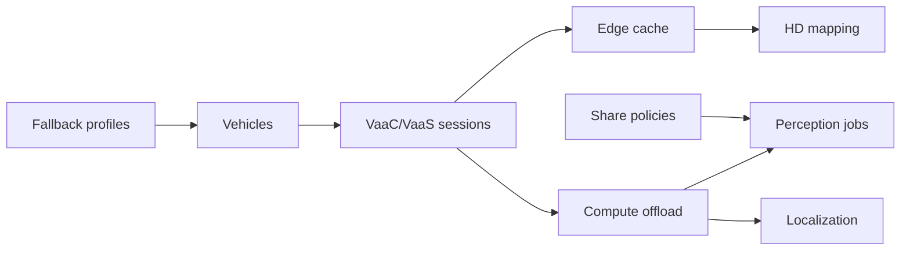

# CurbCache

**Source:** `ai-in-iot/Mobile Edge Intelligence and Computing for the Internet of Vehicles/`
**Domain:** `ai-iot`
**One-liner:** Operates an edge information system for intelligent IoV—caching, compute offload, and edge AI—so vehicles meet sub-100 ms perception, HD mapping, and localization needs without exhausting onboard power or waiting on distant clouds.
**Wedge:** AV/ADAS programs and smart-mobility operators facing TB/h sensor floods (Intel ~4,000 GB/car/day) where onboard GPUs kill range and cloud RTT exceeds safety latency.
**Positioning:** Vehicular edge information system (EIS). Paper argues V2V/V2I and IoV enable safety and city services, but onboard storage/compute and cloud latency both fail; EIS at radio edges provides caching, MEC, and edge AI for perception, HD mapping, and SLAM—Vehicle-as-Client and Vehicle-as-Server patterns, cooperative perception.

## Market research synthesis

### Thesis from source

Road deaths ~1.35M (2016); VANETs and cellular V2X improve safety messaging, while IoV extends Internet-grade services. ADAS growth and SAE L3+ push autonomy; Audi A8 cited as early L3 production. Intelligent vehicles host 200+ sensors, bandwidth ~3–40 Gbit/s; Intel estimates ~4,000 GB/day per AV. Onboard SSD fills in hours; multi-camera DNN load ~250 TOPS; human-competitive action needs ≤100 ms, but cloud RTT often >100 ms and channel-dependent.

EIS deploys storage/compute at wireless edges (RAPs): edge caching for repeated content, edge computing for latency-sensitive tasks (localization/mapping), edge AI for perception/feature extraction. Scenarios: Vehicle as Client (consume edge services) and Vehicle as Server (contribute sensing/compute). Use cases: edge-assisted perception, crowdsourced HD mapping, SLAM/localization with cooperative multi-sensor fusion. Cloud remains for heavy training/software update; edge for real-time loops.

### Buyer & economic model

- **Primary buyer:** VP Autonomy Compute / Smart Mobility infrastructure lead (OEM, tier-1, or city/MNO MEC).
- **Users:** perception engineers, map ops, MEC planners, V2X network engineers, safety assurance.
- **Budget owner / value metric:** autonomy compute + network edge CAPEX/OPEX. Metrics: p95 task latency, cache hit rate, onboard TOPS offloaded, map freshness.
- **Competing status quo:** bigger car GPUs; naive cloud offload; HD maps updated only by dedicated fleets.

### Domain constraints

- **Regulatory / trust / safety:** functional safety; incorrect perception/map can kill; fallback required when edge unreachable.
- **Data sensitivity:** raw camera/LiDAR may be personal/location-sensitive; cooperative share needs policy.
- **Change-management realities:** MNOs, OEMs, and cities must share EIS without exposing proprietary models wholesale.

## Business requirements

- BR-1: Every offload task declares latency class (e.g., ≤100 ms hard real-time vs best-effort).
- BR-2: Edge cache objects include map tiles and model features with freshness SLAs.
- BR-3: Perception jobs may run cooperative fusion only under explicit share policy.
- BR-4: Vehicles degrade gracefully to onboard-only when EIS unavailable—never hang waiting.
- BR-5: HD mapping contributions are crowdsourced with quality scoring before map commit.
- BR-6: Localization assists must publish uncertainty, not only point estimates.
- BR-7: Power budgets for onboard vs offload are comparable for thermal/range impact.
- BR-8: VaaC and VaaS roles are explicit per session.
- BR-9: Safety cases link each EIS dependency to fallback behavior.
- BR-10: Commercial packaging prices by edge sites and active vehicle fleets.
- BR-11: Audit logs retain who consumed/contributed perception features.
- BR-12: Training remains cloud-eligible; real-time inference placement prefers edge.

## User stories

Canonical user stories live in sibling [USER_STORIES.md](USER_STORIES.md).

## System design

### Overview

CurbCache registers edge sites and vehicles, serves cache objects, schedules compute offloads, runs perception/map/localization jobs, and enforces cooperative share policies with safety fallbacks.

### Actors & boundaries

- **Actors:** vehicles, RAP/EIS nodes, map ops, perception stacks, MNOs, safety.
- **Trust boundary:** CurbCache orchestrates EIS services; vehicle control authority remains onboard safety computer.
- **Human-in-the-loop points:** map commit, share-policy changes, safety case updates.

### Core capabilities

1. **Edge site registry** — RAP/MEC inventory.
2. **Vehicle sessions** — VaaC/VaaS roles.
3. **Edge cache** — tiles, models, features.
4. **Compute offload** — latency-class tasks.
5. **Perception jobs** — edge-assisted detect/track.
6. **HD mapping** — crowdsource + commit.
7. **Localization assists** — pose + uncertainty.
8. **Share policies** — cooperative data rules.

### Conceptual data

- **Primary entities:** EdgeSite, Vehicle, CacheObject, OffloadTask, PerceptionJob, MapTile, LocalizationFix, SharePolicy, FallbackProfile.
- **Critical events:** cache hit/miss, offload completed/failed, map committed, fallback engaged, share denied.
- **Retention / audit needs:** safety-relevant decisions retained; raw sensor blobs minimized.

### Integrations (conceptual)

- **Systems of record:** onboard autonomy stack, HD map DB, MEC orchestrator, V2X.
- **Upstream signals:** sensors, GNSS, RAP telemetry.
- **Downstream actions:** return features/poses, update maps, trigger fallback.

### High-level architecture

### Success metrics

- **Leading:** cache hit rate; p95 offload latency; fallback engagement rate.
- **Lagging:** onboard energy/range impact; map-related incidents; corridor capacity.

## OpenAPI skeleton

Canonical HTTP surface lives in sibling `openapi.yaml`. Summarize here:

- **Base path:** `/v1/...`
- **Auth:** API key and/or Bearer JWT (operator)
- **Resource groups:** Sites, Vehicles, Cache, Tasks, Maps
