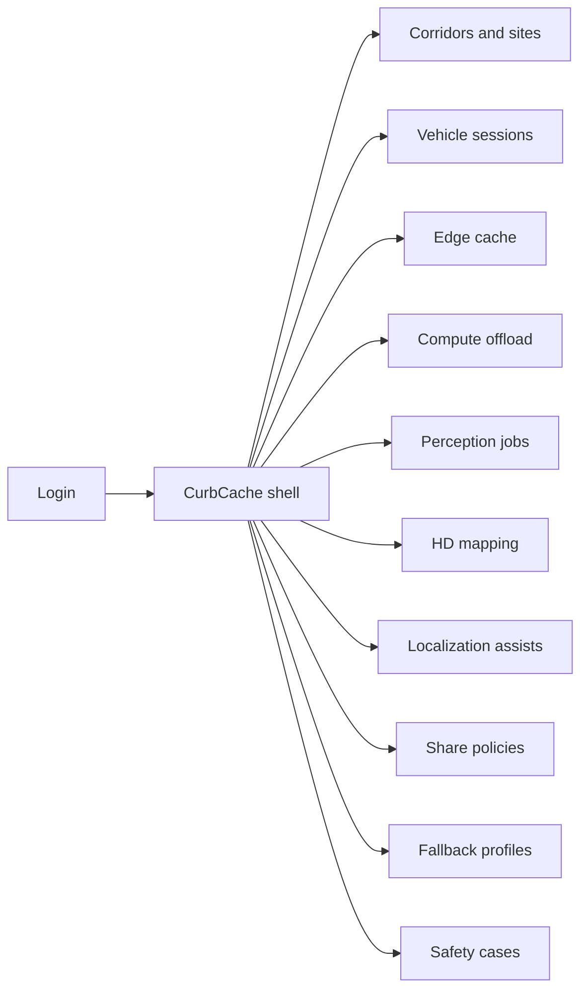
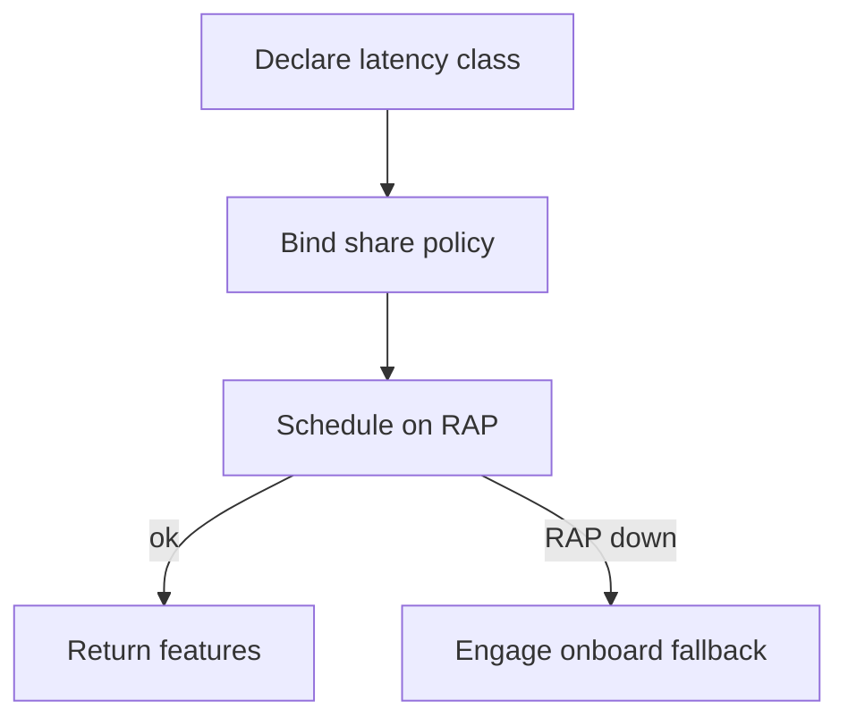
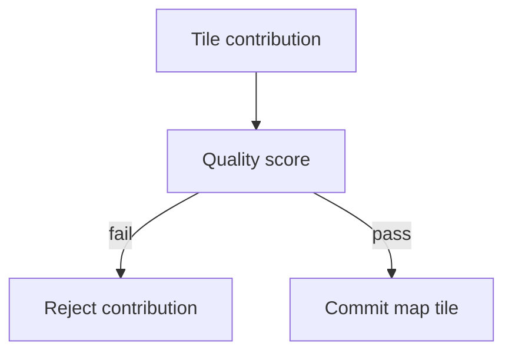

# CurbCache — Web app

**Product:** [PRODUCT.md](./PRODUCT.md)
**Primary surface:** Vehicular edge information system (EIS) ops console (perception, map ops, MEC planners, safety under one CurbCache shell)
**Secondary surfaces:** Safety fallback profile viewer; cooperative share-policy attestation export; corridor capacity read-only for MNO partners
**Design thesis:** CurbCache is a roadside cache and offload curb—not a car GPU shop or a city traffic dashboard. The metaphor is the curb itself: map tiles, model features, and ≤100 ms perception jobs sit at the radio edge so vehicles meet safety timing without burning range on 250 TOPS onboard or hanging on cloud RTT. Visual language is cool asphalt-night and brake-amber on deep charcoal: cache hits feel solid under the wheels; fallback engagement feels like a hard shoulder takeover. The brand wordmark sits as a quiet curb stamp on every offload and map-commit screen so OEM/MNO/city owners always know whose EIS doctrine they are trusting.

## UX research synthesis

### Category peers (best-in-class)

- **AWS Wavelength / Azure Edge Zones / Google Distributed Cloud edge consoles:** RAP/MEC site inventory and latency-to-region mental model. Steal: site-first capacity for corridors; reject generic “edge VM” chrome that ignores VaaC/VaaS and map freshness.
- **HERE / TomTom / Mapbox HD map ops tools:** Tile versioning, freshness, contribution QA. Steal: crowdsourced tile quality before commit; reject consumer map-edit UX for safety-critical HD geometry.
- **NVIDIA DRIVE / Fleet Command patterns:** Perception job health and vehicle fleet sessions. Steal: latency-class task views and power/TOPS offload metrics; reject in-car debugger as the primary operator surface.
- **V2X / C-V2X network management (Qualcomm/MNO lab UIs):** Session roles and link health. Steal: explicit Vehicle-as-Client vs Vehicle-as-Server session chrome; reject RF engineering as the only home.

### Patterns to adopt / reject

- **Adopt:** Latency class on every offload task (hard ≤100 ms vs best-effort); cache objects with freshness SLAs; cooperative fusion only under share policy; mandatory fallback when EIS unreachable; crowdsourced map quality before commit; localization with uncertainty; onboard vs offload power compare; VaaC/VaaS per session; safety case links; audit of feature consume/contribute; cloud training vs edge realtime inference split.
- **Reject:** Bigger-car-GPU as the product story; naive cloud offload wizards; hanging spinners when RAP drops; raw video share as default cooperative mode; purple AI glow; city “smart mobility” vanity KPIs as home; editable map commits without quality score.

### Trust, density, and workflow constraints from PRODUCT.md

Incorrect perception/map can kill—fallback required when edge unreachable (BR-4, BR-9): UI must make fallback profiles first-class, never an afterthought. Raw camera/LiDAR is sensitive; cooperative share needs explicit policy and reject path (BR-3, exception). MNOs, OEMs, and cities share EIS without exposing proprietary models wholesale—tenant isolation on RAPs (admin). Control authority stays onboard; CurbCache orchestrates services only. Safety-relevant decisions retained; raw sensor blobs minimized (BR-11).

## Information architecture

### Nav model

### Roles → default home

| Role | Default home | Why |
|------|--------------|-----|
| Perception engineer | Compute offload + perception jobs | ≤100 ms feature offload (BR-1) |
| Map ops | HD mapping — pending quality scores | Fresh tiles without survey-only fleets (BR-2, BR-5) |
| MEC planner | Corridors and sites — VaaC/VaaS metrics | Size RAP compute (BR-8, BR-10) |
| Safety assurance | Fallback profiles + safety cases | Never hang on network (BR-4, BR-9) |
| V2X / network eng | Vehicle sessions | Role and link health |
| Admin | Site tenant isolation | Multi-OEM coexistence |

### Cross-links to OpenAPI resources

| Nav area | OpenAPI tags / resources |
|----------|---------------------------|
| Edge sites / RAP inventory | Sites |
| Vehicles, VaaC/VaaS sessions | Vehicles |
| Cache objects (tiles, features, models) | Cache |
| Offload tasks, perception jobs | Tasks |
| HD map tiles and commit | Maps |

## Screen inventory

### Corridors and sites home

- **Purpose:** Answer “which RAP/MEC sites are hitting cache and latency SLAs along active corridors?” in one composition.
- **Entry:** MEC planner default; deep link from fallback spikes.
- **Layout regions:** Brand chrome; KPI strip (cache hit rate, p95 offload latency, fallback engagement, onboard TOPS offloaded); site table (corridor, capacity, active VaaC/VaaS, tenant count); alerts rail (freshness breach, SLA miss).
- **Primary actions:** Open site; register RAP; jump to failing tasks; export corridor pack.
- **Empty / loading / error:** Empty = register first edge site; error = retry with request id.
- **BR / story ties:** BR-8, BR-10; MEC planner story.

### Edge site detail

- **Purpose:** Inventory storage/compute at a wireless edge with tenant isolation and peak-corridor sizing.
- **Entry:** Sites → row.
- **Layout regions:** Capacity meters; tenant partitions; cache volume; attached vehicle sessions; power/thermal notes for offload economics.
- **Primary actions:** Adjust capacity reservation; view tenants; open cache; open tasks.
- **Empty / loading / error:** Capacity risk = coral when VaaS peak exceeds plan.
- **BR / story ties:** BR-7, BR-10; admin isolation.

### Vehicle sessions

- **Purpose:** Make VaaC vs VaaS explicit per session with link health and role metrics.
- **Entry:** Vehicles nav; from site.
- **Layout regions:** Session list (role, RAP, latency class mix, share-policy bind); session detail; reject-share log.
- **Primary actions:** Inspect session; force role note; open fallback engagement history.
- **Empty / loading / error:** Empty corridor = no active sessions message.
- **BR / story ties:** BR-8; exception share reject.

### Edge cache browser

- **Purpose:** Manage map tiles, model features, and repeated content with freshness SLAs.
- **Entry:** Cache nav; map ops shortcut for tiles.
- **Layout regions:** Object table (type, freshness SLA, hit rate, sensitivity tag); detail drawer; purge/refresh controls.
- **Primary actions:** Pin object; set freshness SLA; invalidate stale; audit consumers.
- **Empty / loading / error:** Stale = amber cannot be served as fresh; miss storm alert.
- **BR / story ties:** BR-2; map ops freshness story.

### Compute offload board

- **Purpose:** Schedule and monitor latency-class tasks so hard realtime never shares a queue with best-effort quietly.
- **Entry:** Perception engineer default.
- **Layout regions:** Task board by latency class (≤100 ms hard vs best-effort); p95 chronometer; onboard vs offload power compare; failure/fallback column.
- **Primary actions:** Inspect task; requeue best-effort only; open perception job; compare power budget.
- **Empty / loading / error:** Hard-class miss = coral with fallback engaged flag; never indefinite spinner.
- **BR / story ties:** BR-1, BR-4, BR-7; perception engineer story.

### Perception jobs

- **Purpose:** Run edge-assisted detect/track with cooperative fusion only under share policy.
- **Entry:** Tasks → Perception; policy-bound.
- **Layout regions:** Job list; feature return summary (not raw video by default); fusion participants; share-policy gate; audit who consumed/contributed.
- **Primary actions:** Start job; deny share request; export feature audit slice.
- **Empty / loading / error:** Policy deny = explicit reject state (exception story); RAP down = fallback path shown.
- **BR / story ties:** BR-3, BR-11; perception cooperative story.

### HD mapping workspace

- **Purpose:** Crowdsource tile contributions with quality scoring before map commit.
- **Entry:** Map ops default.
- **Layout regions:** Contribution queue; quality score panel; tile diff; freshness SLA; commit gate; survey-fleet vs crowd mix metric.
- **Primary actions:** Score contribution; commit tile; reject; set SLA.
- **Empty / loading / error:** Empty queue = healthy; commit blocked below quality threshold.
- **BR / story ties:** BR-2, BR-5; map ops stories.

### Localization assists

- **Purpose:** Publish pose assists with uncertainty—not point estimates alone.
- **Entry:** From tasks or map context.
- **Layout regions:** Fix stream; uncertainty ellipses/metrics; map tile version used; confidence vs SLA.
- **Primary actions:** Flag low-confidence corridor; bind tile version; open fallback if uncertainty exceeds limit.
- **Empty / loading / error:** Missing uncertainty field = block publish.
- **BR / story ties:** BR-6.

### Share policies

- **Purpose:** Govern cooperative data rules so neighbors cannot siphon features.
- **Entry:** Safety/perception; Vehicles → policy.
- **Layout regions:** Policy list (OEM/city scope); allowed feature classes; deny-by-default posture; vehicle agent reject log.
- **Primary actions:** Publish policy; test deny; attest for partners.
- **Empty / loading / error:** No policy = cooperative fusion disabled.
- **BR / story ties:** BR-3; exception story.

### Fallback profiles and safety cases

- **Purpose:** Mandate onboard-only degrade paths and link each EIS dependency to fallback behavior.
- **Entry:** Safety assurance default.
- **Layout regions:** Fallback profile library; dependency → fallback matrix; engagement timeline; safety case documents.
- **Primary actions:** Bind profile to fleet/site; simulate RAP loss; update safety case; export attestation.
- **Empty / loading / error:** Missing fallback on hard-latency task type = coral block on go-live.
- **BR / story ties:** BR-4, BR-9; safety stories.

## Key flows

1. **Hard-realtime perception offload** — declare ≤100 ms task → bind share policy → schedule on RAP → return features → audit; failure: RAP unavailable → engage fallback, never hang.

2. **Crowdsourced HD tile** — vehicle contributes → quality score → freshness SLA check → commit or reject (BR-5).

3. **VaaS peak sizing** — sessions report VaaS load → MEC adjusts RAP capacity → corridor KPIs update (BR-8).

4. **Cooperative share deny** — neighbor requests features → policy evaluate → reject + audit (exception).

5. **Stale cache protection** — freshness SLA breach → invalidate → map/localization consumers alerted (BR-2, BR-6).

## Design system

### Tokens (CSS variables)

- `--color-ink: #E6EDF2` — primary text
- `--color-asphalt-950: #0A0C10` — app ground
- `--color-asphalt-900: #14181F` — panels
- `--color-asphalt-700: #2C3340` — dividers
- `--color-curb: #5B8DEF` — cache hit / on-SLA offload (cool night blue)
- `--color-curb-dim: #2A4A7A` — blue on dark
- `--color-amber: #E8A317` — stale cache / best-effort queue pressure
- `--color-coral: #E85D4C` — hard-SLA miss / fallback engaged
- `--color-steel: #8A95A5` — secondary labels
- `--color-brand: #A8C4F0` — CurbCache wordmark
- `--font-display: "Agency FB", "Barlow Condensed", sans-serif` — corridor titles and chronometers (expressive, not Inter)
- `--font-body: "Barlow", sans-serif` — body UI
- `--font-mono: "IBM Plex Mono", monospace` — task ids, tile versions, pose uncertainty figures
- `--space-1`…`--space-8`: 4px scale
- `--radius-sm: 4px`; `--radius-md: 8px` — curb-sharp
- `--motion-hit: 140ms ease-out` — cache hit flash
- `--motion-fallback: 200ms ease-in` — shoulder takeover banner
- `--motion-sla: 1000ms linear` — hard-latency chronometer tick (respect reduced-motion)
- Atmosphere: subtle asphalt grain + cool curb-line highlight along left chrome; no stock autonomous-car hero wallpaper in console.

### Typography & brand

- Condensed display for corridor names and p95 chronometers; mono for tile versions, task ids, uncertainty σ.
- Brand wordmark left of shell on offload and map-commit views; never replaced by “Dashboard.”
- Login shell: brand hero; one headline (“Keep safety loops at the curb”); one CTA — no TB/day vanity counters in first viewport.

### Do / don’t

- **Do:** Latency class as primary task chrome; show uncertainty with every fix; quality gate before map commit; fallback banners that replace spinners; VaaC/VaaS labels on sessions; power compare beside offload.
- **Don’t:** Purple AI glow; hang on RAP loss; raw video as default share; editable committed tiles without new score; emoji SLA; card grids for static corridor art.

### Accessibility & domain trust cues

- Contrast AA+; fallback and SLA miss use icon + text.
- Live regions announce fallback engagement and hard-SLA misses.
- Focus order: site → session → task → perception/map → fallback/safety.
- Audit export machine-readable for who consumed/contributed features (BR-11).
- Reduced-motion disables chronometer animation; numeric SLA remains.

## Component patterns

- **LatencyClassBadge** — hard ≤100 ms vs best-effort on every task.
- **CacheFreshnessMeter** — SLA clock on tiles/features.
- **VaaCVaaSSessionChip** — explicit role per vehicle session.
- **OffloadChronometer** — p95 vs class with miss coral state.
- **PowerBudgetCompare** — onboard TOPS vs offload energy/range impact.
- **MapQualityGate** — crowdsource score before commit.
- **UncertaintyPoseReadout** — localization with σ, not point-only.
- **FallbackShoulderBanner** — RAP-down degrade path (blocks hang UX).
- **SharePolicyDenyRow** — cooperative reject with audit affordance.

## Out of scope for v1 web

- Onboard safety computer / drive-by-wire UI; consumer driver app; full HD map cartography suite; RAP radio planning RF tools; cloud training cluster IDE (training stays cloud-eligible elsewhere); city traffic-signal ATMS replacement.
